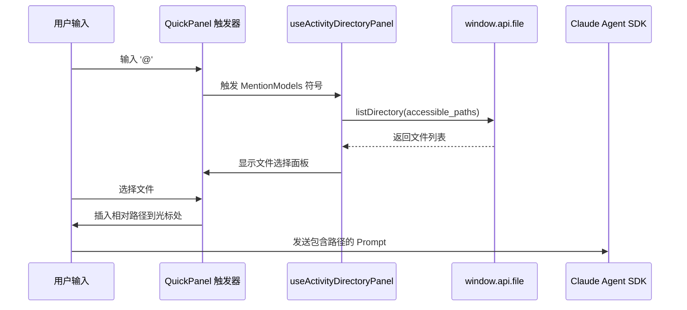
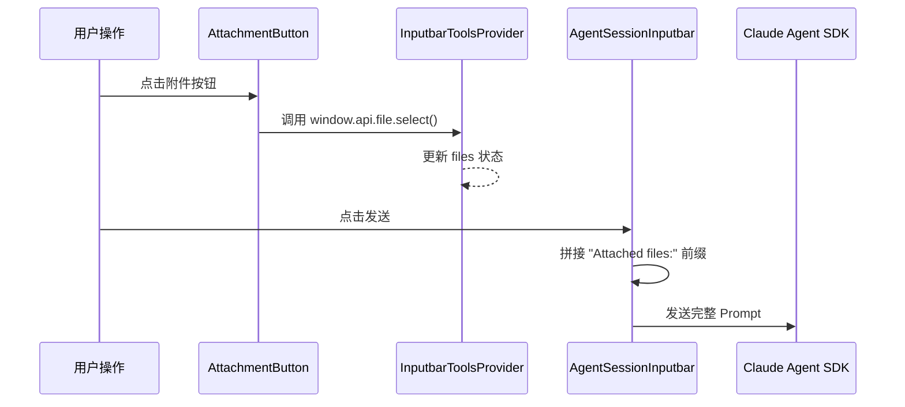
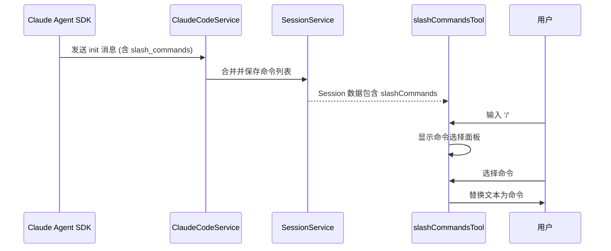
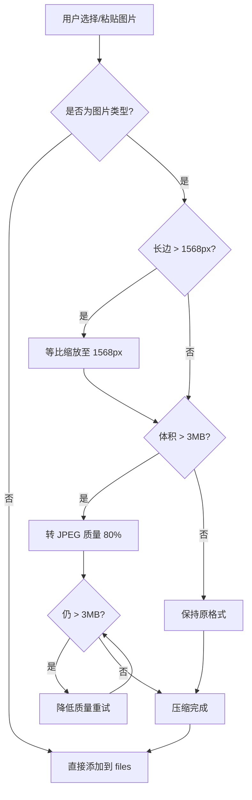

# Cherry Studio Agent 输入功能与 SDK 接口文档

本文档详细说明了 Cherry Studio Agent 模式下三个核心输入功能（`@文件`、`添加文件`、`斜杠命令`）的实现方式及其与 Claude Agent SDK 的对应关系，以及图片压缩功能的实现方案。

---

## 功能总览

| 功能 | 触发方式 | 路径格式 | 发送机制 | SDK 接口 |
|:---|:---|:---|:---|:---|
| **@ 文件** | 输入 `@` 符号 | 相对路径 | 文本内联 (Inline) | `query()` - Prompt 参数 |
| **添加文件** | 点击回形针图标 | 绝对路径 | 文本追加 (Appended) | `query()` - Prompt 参数 |
| **斜杠命令** | 输入 `/` 符号 | N/A | 命令替换 (Replaced) | SDK `init` 消息 |

---

## 1. @ 文件 (Activity Directory)

### 1.1 功能说明
允许用户在输入框中通过 `@` 符号快速引用 Agent 可访问目录中的文件。

### 1.2 实现架构



### 1.3 核心文件

| 文件 | 作用 |
|:---|:---|
| [activityDirectoryTool.tsx](file:///Users/huawang/pyproject/cherry-studio-main/src/renderer/src/pages/home/Inputbar/tools/activityDirectoryTool.tsx) | 工具定义，配置触发符号和作用域 |
| [useActivityDirectoryPanel.ts](file:///Users/huawang/pyproject/cherry-studio-main/src/renderer/src/pages/home/Inputbar/tools/components/useActivityDirectoryPanel.ts) | 核心 Hook，处理文件扫描和路径插入 |
| [ActivityDirectoryButton.tsx](file:///Users/huawang/pyproject/cherry-studio-main/src/renderer/src/pages/home/Inputbar/tools/components/ActivityDirectoryButton.tsx) | UI 按钮组件 |

### 1.4 路径处理逻辑

```typescript
// 从 useActivityDirectoryPanel.ts 提取
const insertFilePath = (filePath: string) => {
  setText((currentText) => {
    // 查找 @ 触发符位置
    const lastAtIndex = currentText.lastIndexOf('@')
    // 替换 @ 及其后的搜索文本为相对路径
    return currentText.slice(0, lastAtIndex) + filePath + currentText.slice(cursorPos)
  })
}
```

### 1.5 Prompt 示例

**用户输入**:
```
请检查 @src/utils/helper.ts 的代码逻辑
```

**发送给 Agent SDK 的内容**:
```
请检查 src/utils/helper.ts 的代码逻辑
```

> [!NOTE]
> `@` 符号本身会被移除，只保留相对路径。Agent 根据其 `cwd` (工作目录) 定位文件。

---

## 2. 添加文件 (Attachment)

### 2.1 功能说明
允许用户通过点击附件按钮或拖拽方式选择本地文件，文件路径会在发送时追加到消息末尾。

### 2.2 实现架构



### 2.3 核心文件

| 文件 | 作用 |
|:---|:---|
| [attachmentTool.tsx](file:///Users/huawang/pyproject/cherry-studio-main/src/renderer/src/pages/home/Inputbar/tools/attachmentTool.tsx) | 工具定义 |
| [AttachmentButton.tsx](file:///Users/huawang/pyproject/cherry-studio-main/src/renderer/src/pages/home/Inputbar/tools/components/AttachmentButton.tsx) | 文件选择 UI 和逻辑 |
| [InputbarToolsProvider.tsx](file:///Users/huawang/pyproject/cherry-studio-main/src/renderer/src/pages/home/Inputbar/context/InputbarToolsProvider.tsx) | 状态管理 (`files` 数组) |
| [AgentSessionInputbar.tsx](file:///Users/huawang/pyproject/cherry-studio-main/src/renderer/src/pages/home/Inputbar/AgentSessionInputbar.tsx#L397-L402) | 发送时路径拼接逻辑 |

### 2.4 路径拼接逻辑

```typescript
// 从 AgentSessionInputbar.tsx 第 398-401 行
let messageText = text
if (files.length > 0) {
  const filePaths = files.map((file) => file.path).join('\n')
  messageText = text 
    ? `${text}\n\nAttached files:\n${filePaths}` 
    : `Attached files:\n${filePaths}`
}
```

### 2.5 Prompt 示例

**用户输入**: `帮我优化代码逻辑`  
**选择的文件**: `/Users/dev/project/src/main.ts`, `/Users/dev/project/src/utils.ts`

**发送给 Agent SDK 的内容**:
```
帮我优化代码逻辑

Attached files:
/Users/dev/project/src/main.ts
/Users/dev/project/src/utils.ts
```

---

## 3. 斜杠命令 (Slash Commands)

### 3.1 功能说明
允许用户通过 `/` 符号触发 Agent 支持的特殊命令（如 `/clear`, `/help` 等）。

### 3.2 实现架构



### 3.3 核心文件

| 文件 | 作用 |
|:---|:---|
| [slashCommandsTool.tsx](file:///Users/huawang/pyproject/cherry-studio-main/src/renderer/src/pages/home/Inputbar/tools/slashCommandsTool.tsx) | 前端工具定义和 UI |
| [index.ts (ClaudeCodeService)](file:///Users/huawang/pyproject/cherry-studio-main/src/main/services/agents/services/claudecode/index.ts#L452-L504) | 后端命令发现和合并逻辑 |

### 3.4 SDK 接口映射

**SDK Init 消息结构**:
```typescript
// SDK 发送的 init 消息
{
  type: 'system',
  subtype: 'init',
  slash_commands: ['/bug', '/clear', '/compact', '/help', '/init', '/review', ...]
}
```

**后端处理** (`ClaudeCodeService.processSDKQuery`):
```typescript
if (message.type === 'system' && message.subtype === 'init') {
  const sdkSlashCommands = message.slash_commands || []
  
  // 获取本地已有命令
  const existingCommands = await sessionService.listSlashCommands('claude-code', agentId)
  
  // 合并去重
  const commandMap = new Map()
  for (const cmd of existingCommands) commandMap.set(cmd.command, cmd)
  for (const cmd of sdkCommands) {
    if (!commandMap.has(cmd.command)) commandMap.set(cmd.command, cmd)
  }
  
  // 更新到数据库
  await sessionService.updateSession(agentId, sessionId, {
    slash_commands: Array.from(commandMap.values())
  })
}
```

---

## 4. 图片压缩实现方案

### 4.1 问题背景
当前 Agent 模式下上传图片时，如果图片超过 30MB 会报错。原因是：
1. Cherry Studio **不会自动压缩图片**
2. Claude API 对单图限制约为 **5MB** (Base64 解码后)
3. 现有 `compressImage` 工具函数未被附件流程调用

### 4.2 压缩策略

> [!IMPORTANT]
> 以下压缩策略基于用户需求设计，核心原则：**优先保证图片可用性，其次控制体积**。

| 步骤 | 条件 | 操作 |
|:---|:---|:---|
| 1 | 检查长边 | 获取图片宽高，取较大值 |
| 2 | 长边超限 | 等比缩放至长边 ≤ `MAX_DIMENSION` (建议 1568px) |
| 3 | 体积 > 3MB | 转换为 JPEG 格式，质量 80% |
| 4 | 仍 > 3MB | 降低 JPEG 质量至 60%，重复直至达标 |

### 4.3 实现代码 (建议)

```typescript
// 建议添加到 src/renderer/src/utils/image.ts

interface CompressOptions {
  maxDimension?: number  // 默认 1568
  maxSizeMB?: number     // 默认 3
  initialQuality?: number // 默认 0.8
}

export const compressImageForAgent = async (
  file: File,
  options: CompressOptions = {}
): Promise<File> => {
  const {
    maxDimension = 1568,
    maxSizeMB = 3,
    initialQuality = 0.8
  } = options

  // 加载图片获取尺寸
  const img = await loadImage(file)
  const longerSide = Math.max(img.width, img.height)

  // 步骤 1-2: 检查并缩放长边
  let targetWidth = img.width
  let targetHeight = img.height
  
  if (longerSide > maxDimension) {
    const scale = maxDimension / longerSide
    targetWidth = Math.round(img.width * scale)
    targetHeight = Math.round(img.height * scale)
  }

  // 创建 Canvas 并绘制
  const canvas = document.createElement('canvas')
  canvas.width = targetWidth
  canvas.height = targetHeight
  const ctx = canvas.getContext('2d')!
  ctx.drawImage(img, 0, 0, targetWidth, targetHeight)

  // 步骤 3-4: 体积检查和 JPEG 压缩
  const maxSizeBytes = maxSizeMB * 1024 * 1024
  let quality = initialQuality
  let blob: Blob

  do {
    blob = await new Promise<Blob>((resolve) => {
      canvas.toBlob((b) => resolve(b!), 'image/jpeg', quality)
    })
    
    if (blob.size <= maxSizeBytes) break
    
    quality -= 0.1  // 每次降低 10%
  } while (quality >= 0.3)

  return new File([blob], file.name.replace(/\.[^.]+$/, '.jpg'), {
    type: 'image/jpeg'
  })
}

// 辅助函数：加载图片
const loadImage = (file: File): Promise<HTMLImageElement> => {
  return new Promise((resolve, reject) => {
    const img = new Image()
    img.onload = () => resolve(img)
    img.onerror = reject
    img.src = URL.createObjectURL(file)
  })
}
```

### 4.4 集成点

需要在以下位置调用压缩函数：

| 文件 | 位置 | 修改说明 |
|:---|:---|:---|
| [AttachmentButton.tsx](file:///Users/huawang/pyproject/cherry-studio-main/src/renderer/src/pages/home/Inputbar/tools/components/AttachmentButton.tsx#L48-L56) | `openFileSelectDialog` 回调 | 选择文件后，对图片类型文件调用压缩 |
| [usePasteHandler.ts](file:///Users/huawang/pyproject/cherry-studio-main/src/renderer/src/pages/home/Inputbar/hooks/usePasteHandler.ts) | `handlePaste` 函数 | 粘贴图片时调用压缩 |

### 4.5 处理流程



---

## 5. SDK 接口映射总结

### 5.1 Claude Agent SDK 核心接口

```typescript
import { query, Options } from '@anthropic-ai/claude-agent-sdk'

// 主查询接口
const stream = query({
  prompt: AsyncIterable<UserInputMessage>,  // 用户消息流
  options: Options                           // SDK 配置
})
```

### 5.2 Options 关键配置

| 配置项 | 类型 | 说明 | Cherry Studio 对应 |
|:---|:---|:---|:---|
| `cwd` | `string` | Agent 工作目录 | `session.accessible_paths[0]` |
| `systemPrompt` | `object` | 系统提示词 | `session.instructions` |
| `permissionMode` | `string` | 权限模式 | `session.configuration.permission_mode` |
| `allowedTools` | `string[]` | 允许的工具 | `session.allowed_tools` |
| `mcpServers` | `object` | MCP 服务器配置 | `session.mcps` |
| `resume` | `string` | 恢复会话 ID | `lastAgentSessionId` |

### 5.3 SDK 消息类型

| 消息类型 | 说明 | Cherry Studio 处理 |
|:---|:---|:---|
| `system.init` | 初始化消息，包含 slash_commands | 合并命令到 Session |
| `assistant.text` | 文本回复 | 流式显示 |
| `assistant.tool_use` | 工具调用请求 | 触发权限检查 |
| `result` | 最终结果 | 标记完成 |

---

## 参考资料

- [Claude Agent SDK 类型定义](file:///Users/huawang/pyproject/cherry-studio-main/node_modules/@anthropic-ai/claude-agent-sdk/dist/types.d.ts)
- [ClaudeCodeService 实现](file:///Users/huawang/pyproject/cherry-studio-main/src/main/services/agents/services/claudecode/index.ts)
- [AgentSessionInputbar 前端组件](file:///Users/huawang/pyproject/cherry-studio-main/src/renderer/src/pages/home/Inputbar/AgentSessionInputbar.tsx)
