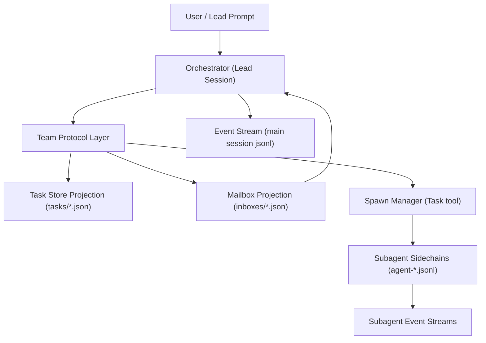
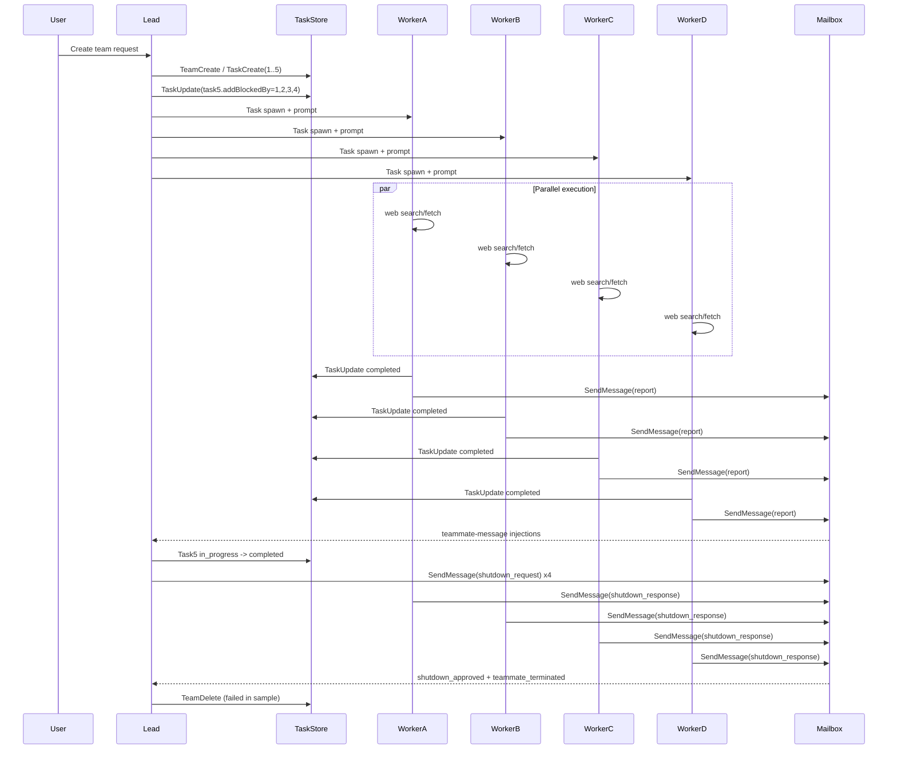
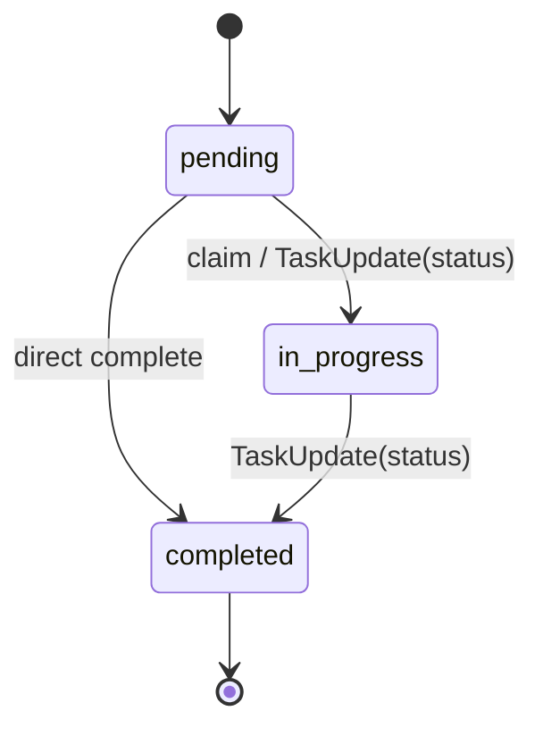
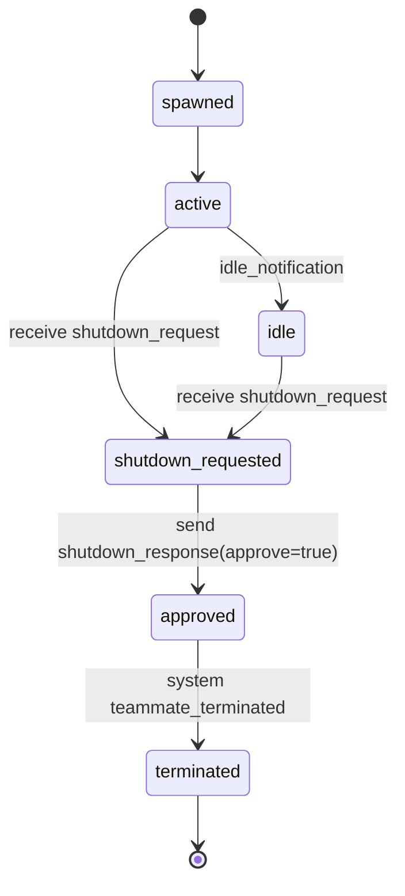

# Agent Team 架构实现分析（完整实现视角）

## 0. 文档目的与分析范围

本文档基于两组运行时数据做"可实现级别"的逆向分析，目标是足够指导研发团队实现一个同类 Agent Team 系统。

分析数据范围：

**样本 A：google-2026-prediction（研究型团队）**

1. Team/Task 投影数据（控制面与共享状态）
   `/Users/huawang/pyproject/claudeagent/teams/google-2026-prediction/*`
   `/Users/huawang/pyproject/claudeagent/tasks/google-2026-prediction/*`
2. Session 持久化事件流（执行面）
   `/Users/huawang/pyproject/claudeagent/-Users-huawang-Documents-aadagent/213d28ea-0bf2-4ea1-bb01-dad70b8cb2ff.jsonl`
   `/Users/huawang/pyproject/claudeagent/-Users-huawang-Documents-aadagent/213d28ea-0bf2-4ea1-bb01-dad70b8cb2ff/subagents/*.jsonl`

**样本 B：holdem-team（工程型团队）**

1. Team/Task 投影数据
   `/Users/huawang/pyproject/claudeagent/teams/holdem-team/*`
   `/Users/huawang/pyproject/claudeagent/tasks/holdem-team/*`
2. Session 持久化事件流
   `/Users/huawang/pyproject/claudeagent/-Users-huawang-pyproject-agentholdem/f38629b8-90ef-49c2-83d1-fe0cca545f34.jsonl`
   `/Users/huawang/pyproject/claudeagent/-Users-huawang-pyproject-agentholdem/f38629b8-90ef-49c2-83d1-fe0cca545f34/subagents/*.jsonl`
3. Memory 持久化
   `/Users/huawang/pyproject/claudeagent/-Users-huawang-pyproject-agentholdem/memory/MEMORY.md`

关键事实统计：

**样本 A (google-2026-prediction)**
- 主会话事件：79 条
- 子会话事件：249 条
- 子会话 progress 事件：96 条
- 主会话 tool 调用：24 次
- 子会话 tool 调用：61 次
- 执行总时长：约 261.7 秒（2026-02-06 13:10:17 EST 到 13:14:39 EST）
- 子 agent 数量：4（financial-researcher, segment-analyst, ai-researcher, competitive-analyst）
- Lead 编码参与：0%（纯编排 + 汇总）

**样本 B (holdem-team)**
- 主会话事件：226 条
- 子 agent 会话文件：4 个（2 个工作会话 + 2 个关停会话）
- 执行总时长：约 593.7 秒（2026-02-07 04:57:17 EST 到 05:07:10 EST）
- 子 agent 数量：2（engine-dev, ai-dev）
- Lead 编码参与：73%（11/15 个 Python 文件由 lead 直接编写）

## 1. 架构总览

### 1.1 设计风格

该系统是“事件流 + 本地投影”的混合架构：

1. **事件流是事实源（Source of Truth）**：`*.jsonl` 按时间追加，记录用户消息、模型输出、工具调用、工具结果、progress。
2. **文件投影是查询/协作面**：`teams/*/config.json`、`tasks/*/*.json`、`inboxes/*.json` 提供可读可协作状态。
3. **协作机制为 mailbox + shared task list**：消息与任务解耦。

### 1.2 四层分解



### 1.3 核心实体

1. **Lead Session**：编排者，创建团队、创建任务、拉起子 agent、汇总结果、关停清理。在工程型团队中，Lead 还可直接参与编码实现（见 holdem-team 样本，Lead 完成 73% 编码工作）。
2. **Subagent Session**：执行者，接收任务 prompt，调用外部工具（web search/fetch 或 Read/Write/Edit/Bash），更新任务状态，回传报告。工具集取决于任务类型和 spawn 参数。
3. **Task Store**：共享任务列表，支持依赖（`blockedBy`）和反向边（`blocks`）。
4. **Mailbox Store**：每个 agent 的收件箱，承载控制消息与业务内容。
5. **Event Store**：主/子会话 JSONL，支持完整回放与审计。

## 2. 目录与持久化布局

### 2.1 目录结构（两个样本）

```text
/Users/huawang/pyproject/claudeagent/
├── tasks/
│   ├── google-2026-prediction/          # 样本 A
│   │   ├── .lock
│   │   ├── 1.json ... 9.json            # 5 个用户任务 + 4 个内部任务
│   ├── holdem-team/                     # 样本 B
│   │   ├── .lock
│   │   ├── 1.json ... 7.json            # 5 个用户任务 + 2 个内部任务
│   ├── f5b1acb3-.../                    # 历史任务目录
│   │   ├── .lock
│   │   └── .highwatermark
├── teams/
│   ├── google-2026-prediction/
│   │   ├── config.json
│   │   └── inboxes/
│   │       ├── team-lead.json
│   │       ├── financial-researcher.json
│   │       ├── segment-analyst.json
│   │       ├── ai-researcher.json
│   │       └── competitive-analyst.json
│   └── holdem-team/
│       ├── config.json
│       └── inboxes/
│           ├── team-lead.json
│           ├── engine-dev.json
│           └── ai-dev.json
├── -Users-huawang-Documents-aadagent/   # 样本 A 事件流（cwd slug）
│   ├── 213d28ea-...jsonl                # 主会话
│   └── 213d28ea-.../
│       └── subagents/
│           ├── agent-a0c5f87.jsonl       # 8 个子会话（4 工作 + 4 关停）
│           └── ...
└── -Users-huawang-pyproject-agentholdem/ # 样本 B 事件流（cwd slug）
    ├── f38629b8-...jsonl                # 主会话
    ├── f38629b8-.../
    │   └── subagents/
    │       ├── agent-a32fdfb.jsonl       # 4 个子会话（2 工作 + 2 关停）
    │       └── ...
    └── memory/
        └── MEMORY.md                    # 跨会话持久化记忆
```

### 2.2 路径命名规则推断

1. 会话根目录名 `-Users-huawang-Documents-aadagent` 是 `cwd` 的路径转义/slug。
2. 主会话日志文件名即 `leadSessionId`：`213d28ea-... .jsonl`。
3. 子会话存放在同名目录下的 `subagents/agent-*.jsonl`。
4. team/task 投影目录采用 `team_name` 作为 key：`google-2026-prediction`。

### 2.3 锁与水位

观测到 `.lock` 文件用于并发写保护。  
历史任务目录存在 `.highwatermark`，但本次 `google-2026-prediction` 没有 `.highwatermark`，说明版本演进或不同运行阶段策略不一致。

## 3. 数据模型（投影层）

### 3.1 Team Config 模型

样本：`/Users/huawang/pyproject/claudeagent/teams/google-2026-prediction/config.json`

字段：

1. `name`: 团队名（全局 key）
2. `description`: 团队目标
3. `createdAt`: 毫秒时间戳
4. `leadAgentId`
5. `leadSessionId`
6. `members[]`: 元数据（agentId/name/agentType/model/cwd 等）

注意点：

1. 两个样本的 `members` 均只记录 lead，不包含 spawn 出的 teammate。这不是"最小配置快照"，而是**设计缺陷**——spawn 操作只创建子 agent 会话和内部任务（`_internal=true`），**不回写 `config.json` 的 `members` 数组**。子 agent 的元信息只存在于事件流中（`Task` tool 返回的 `teammate_spawned` 事件）。
2. `model` 字段记录 lead 在创建团队时使用的模型。子 agent 实际使用的模型由 spawn 时的 `subagent_type` 和系统策略决定，可能不同于 lead 模型（见第 10.2 节）。这是有意为之的设计——可以用更便宜的模型执行子任务。

### 3.2 Task 模型

样本：`/Users/huawang/pyproject/claudeagent/tasks/google-2026-prediction/1.json` 等

```json
{
  "id": "1",
  "subject": "...",
  "description": "...",
  "activeForm": "...",
  "owner": "optional",
  "status": "pending|in_progress|completed",
  "blocks": ["5"],
  "blockedBy": [],
  "metadata": {
    "reason": "..."
  }
}
```

语义：

1. `blockedBy`: 依赖前置任务列表。
2. `blocks`: 反向依赖列表。
3. `activeForm`: 任务进行时显示文案。
4. `metadata.reason`: 任务状态变化的人类可读原因。
5. `metadata._internal=true`: 内部任务（样本中 6-9）。

### 3.3 Inbox Envelope 模型

样本：`/Users/huawang/pyproject/claudeagent/teams/google-2026-prediction/inboxes/team-lead.json`

```json
{
  "from": "segment-analyst",
  "text": "...string payload...",
  "summary": "optional",
  "timestamp": "2026-02-06T18:13:14.977Z",
  "color": "green",
  "read": true
}
```

语义：

1. Envelope 固定字段较少，协议主要在 `text` 内层。
2. `text` 是字符串，多态承载：
   - JSON 控制消息（stringified JSON）
   - Markdown 报告正文
   - 纯文本
3. `summary` 在长报告场景普遍存在。
4. `color` 体现 agent 视觉标签（blue/green/yellow/purple/red）。

### 3.4 消息协议（text payload）

控制消息类型（样本出现）：

1. `task_assignment`
2. `idle_notification`
3. `shutdown_request`
4. `shutdown_approved`

注入到 lead 的系统消息：

1. `teammate_terminated`（作为 `<teammate-message teammate_id="system">` payload）

业务消息：

1. `type=message` 的长 Markdown 报告（财务、分部、AI、竞争分析）

### 3.5 任务分配双轨制

系统中存在两种任务分配机制：

**路径 A：Spawn-time prompt injection（主路径）**

任务描述写在 `Task` 工具的 `prompt` 参数中，子 agent 启动时即知任务内容。这是主要分配路径——google-2026-prediction 中 3/4 个 agent（segment-analyst、ai-researcher、competitive-analyst）只通过此路径获得任务，其 inbox 中没有 `task_assignment` 消息。

**路径 B：Runtime message assignment（辅助路径）**

通过 `SendMessage` 发送 `task_assignment` 到 inbox。google-2026-prediction 中 financial-researcher 的 inbox 有此类消息。holdem-team 中 team-lead.json 记录了 3 条 `task_assignment`（tasks 1, 4, 5），说明 **lead 给自己分配任务也会产生 inbox 审计记录**。

**工程意义**：这不是"自环消息异常"，而是设计行为——inbox 同时承担通信和审计两个角色。实现时应明确区分这两种分配路径的适用场景。

## 4. 事件流模型（Session JSONL）

### 4.1 主会话事件类型

文件：`/Users/huawang/pyproject/claudeagent/-Users-huawang-Documents-aadagent/213d28ea-0bf2-4ea1-bb01-dad70b8cb2ff.jsonl`

类型：

1. `file-history-snapshot`
2. `user`
3. `assistant`
4. `system`（`subtype=turn_duration`）

共有字段：

1. `uuid`
2. `parentUuid`
3. `timestamp`
4. `sessionId`
5. `cwd`
6. `version=2.1.34`
7. `gitBranch=HEAD`
8. `isSidechain`（主会话为 false）

### 4.2 子会话事件类型

文件：`.../subagents/agent-*.jsonl`

类型：

1. `user`
2. `assistant`
3. `progress`

`progress` 结构（多种子类型）：

```json
// MCP 工具进度（研究型子 agent）
{
  "type": "progress",
  "data": {
    "type": "mcp_progress",
    "status": "started|completed",
    "serverName": "web",
    "toolName": "search|fetch",
    "elapsedTimeMs": 1708
  },
  "toolUseID": "...",
  "parentToolUseID": "..."
}

// Hook 进度（工程型主会话）
{
  "type": "progress",
  "data": {
    "type": "hook_progress",
    "hookEvent": "PostToolUse",
    "hookName": "PostToolUse:Write",
    "command": "callback"
  }
}

// Bash 命令进度（工程型主会话）
{
  "type": "progress",
  "data": {
    "type": "bash_progress",
    "command": "...",
    "status": "started|completed"
  }
}
```

### 4.3 链式关系

1. 主会话 `parentUuid` 近似严格线性链（0 断链）。
2. 长子会话因并发工具调用形成局部分叉 DAG（不是简单线性）。
3. 5 个短子会话（2~3 行）首个 `parentUuid` 指向其他子会话事件，体现 sidechain-on-sidechain 派生。

## 5. 工具接口与协议约束

## 5.1 Lead 侧工具调用（样本）

**共有工具（两个团队均使用）：**

1. `TeamCreate`
2. `TaskCreate`
3. `TaskUpdate`
4. `Task`（用于 spawn teammate）
5. `TaskList`
6. `SendMessage`
7. `TeamDelete`

**工程型团队 Lead 额外使用的工具（holdem-team）：**

8. `Write`（创建源代码文件，14+ 次）
9. `Read`（读取子 agent 产出的文件）
10. `Edit`（修改已有代码，修复测试中发现的 bug）
11. `Bash`（创建目录、运行 pytest、执行压力测试）
12. `Glob`（查找文件）

这是两种团队范式的关键差异：研究型 lead 仅使用编排工具，工程型 lead 同时使用编排工具和开发工具。

### 5.2 关键 schema（从调用与返回反推）

`TeamCreate`

- Input: `team_name, description, agent_type`
- Output: `team_name, team_file_path, lead_agent_id`

`TaskCreate`

- Input: `subject, description, activeForm`
- Output: `{ task: { id, subject } }`

`TaskUpdate`

- Input:
  - `taskId + status`
  - `taskId + addBlockedBy`
  - `taskId + metadata + status`
- Output: `success, taskId, updatedFields, statusChange?`

`Task`（spawn）

- Input: `team_name, name, description, prompt, subagent_type`
  - 可选: `run_in_background=true`（异步启动子 agent，lead 不阻塞等待）
  - 可选: `mode=bypassPermissions`（子 agent 无需用户确认即可执行写文件/运行命令等操作）
- Output: `status=teammate_spawned` + `teammate_id/agent_id/name/model/color/...`

**`run_in_background` 的调度意义**：这是 lead 并行工作的关键机制。holdem-team 中 lead 使用此参数异步启动子 agent 后，自己继续完成 task 1 和 task 4 的编码，不需要等待子 agent 完成。

**`mode=bypassPermissions` 的安全影响**：子 agent 可以在没有人类干预的情况下大量修改文件。适用于信任度高的封闭任务环境，但在生产系统中需要审慎评估。

`SendMessage`

- 关停请求 Input: `type=shutdown_request, recipient, content`
- 业务消息 Input: `type=message, recipient, summary, content`
- 关停响应 Input: `type=shutdown_response, request_id, approve`

`TaskList` / `TeamDelete`

- 样本中带 `reason` 均触发 `InputValidationError`
- 说明接口启用严格 schema 校验（未知字段拒绝）

### 5.3 子 agent 工具调用

**研究型子 agent（google-2026-prediction）：**

1. `mcp__web__search`（`query`）
2. `mcp__web__fetch`（`url`）
3. `TaskUpdate`
4. `SendMessage`

**工程型子 agent（holdem-team）：**

1. `Read`（读取 lead 创建的基础模块，如 card.py、deck.py、hand_eval.py）
2. `Write`（创建实现文件，如 player.py、game.py、ai.py）
3. `TaskUpdate`
4. `TaskList`（查询全局任务状态）
5. `SendMessage`

关键差异：工程型子 agent **先 Read 共享代码库中的依赖文件**，再 Write 自己的实现。这形成了文件层面的隐式依赖链。

## 6. 执行流程（端到端）

### 6.1 阶段化流程

1. **Bootstrapping**  
   用户请求创建团队，lead 调用 `TeamCreate`。
2. **Planning & Task Graph**  
   lead 创建任务 1-5；设置任务 5 的依赖 `blockedBy=[1,2,3,4]`。
3. **Spawn Workers**  
   lead 通过 `Task` 拉起四个 teammate（financial/segment/ai/competitive）。
4. **Parallel Research**  
   四个长子会话并行检索、抓取、整合，写回任务状态并发送报告给 lead。
5. **Aggregation**  
   lead 接收 4 份长报告 + idle 通知，更新任务状态（含任务 5 的 in_progress/completed）。
6. **Shutdown**  
   lead 向 4 个 teammate 发送 `shutdown_request`。
7. **Shutdown Ack**  
   teammate 回 `shutdown_response`，lead inbox 记录 `shutdown_approved`。
8. **Cleanup Attempt**  
   lead 调 `TeamDelete(reason=...)`，因参数不合法失败。

### 6.2 时序图



## 7. 状态机机制

### 7.1 Task 状态机



依赖机制：

1. 若任务 `blockedBy` 非空且依赖未完成，不可自然进入执行。
2. 观测到任务 5 先设置依赖，再在依赖任务完成后进入 `in_progress`，最后 `completed`。

### 7.2 Teammate 生命周期状态机



## 8. 通信机制（Mailbox + 注入）

### 8.1 发送模型

1. 所有 agent 间通信经 `SendMessage` 工具落盘到 inbox。
2. 收件箱按 recipient 维度分文件。
3. 同一消息在投影层与事件层都有痕迹：
   - 投影层：`inboxes/*.json`
   - 事件层：`tool_result` + 后续 `<teammate-message>` 注入

### 8.2 lead 注入模型

lead 会话收到 teammate 消息时，被包装成用户输入片段：

```xml
<teammate-message teammate_id="ai-researcher" color="yellow">
{"type":"idle_notification", ...}
</teammate-message>
```

特征：

1. 支持批量注入（一次 user 事件中包含多条 teammate-message）。
2. 包含 `teammate_id` 与可选 `color`。
3. `system` 也作为一个 teammate_id 注入（`teammate_terminated`）。
4. **批量注入的时机**：当 lead 正在执行一个长 turn（如写代码、跑测试）时，子 agent 的消息会在 inbox 中堆积。当 lead turn 结束后，下一个 turn 开始时，所有积压消息被**一次性批量注入**为一个 user 事件。holdem-team 的最终 turn 中包含了 task_assignment、idle_notification、shutdown_approved、teammate_terminated 等多种消息的混合批量注入。

### 8.3 路由元数据

业务 `SendMessage(type=message)` 的 tool result 包含 `routing`：

1. `sender`
2. `senderColor`
3. `target`
4. `targetColor`
5. `summary`
6. `content`

这意味着系统内部存在路由层，可用于 UI 渲染和审计。

### 8.4 关停握手协议

1. lead -> teammate: `shutdown_request`
2. teammate -> lead: `shutdown_response`（`request_id`, `approve=true`）
3. inbox 记录：`shutdown_approved`
4. system 注入：`teammate_terminated`

样本中 4 个 `request_id` 在响应与批准完全一致，说明协议闭环可验证。

## 9. 并发与调度机制

### 9.1 并发单元

1. lead 为单编排线程（逻辑上）。
2. 四个研究子 agent 并行执行。
3. 关停阶段额外出现短子会话，处理 shutdown_response。

### 9.2 子 agent 执行模式

每个长子会话典型 pipeline：

1. 批量发起 `search`
2. 批量发起 `fetch`
3. `TaskUpdate(status/metadata)`
4. `SendMessage(report)`

progress 数据体现工具执行时间：

1. 搜索/抓取平均延迟约 1~3 秒量级
2. 观察到最大 ~9.9 秒（网络波动）

### 9.3 调度细节

1. 任务领取可显式也可隐式。样本中财务任务出现 `owner` 字段，其它任务在最终投影未填 owner。
2. lead 有二次 `TaskUpdate(status=completed)` 行为，但 `updatedFields=[]`，说明后端是幂等更新。

## 10. 一致性、恢复与异常处理

### 10.1 一致性模型

更像“最终一致”而非“强一致”：

1. 事件先行，投影后刷。
2. 同步窗口内可能出现“消息已到达但状态未完全收敛”。

### 10.2 已观测异常/边界

1. **参数校验严格失败**（两个团队均出现）
   - `TaskList(reason=...)` 报错
   - `TeamDelete(reason=...)` 报错
   - holdem-team 中 `TeamDelete` 甚至重试了一次仍然失败（同样的参数错误）
2. **内部任务残留**（两个团队均出现）
   - google-2026-prediction：`6..9.json`（`_internal=true`）保持 `in_progress`
   - holdem-team：`6..7.json`（`_internal=true`）保持 `in_progress`
   - 内部任务代表子 agent 的运行实例，agent 关停后未自动清理
3. **成员信息投影不完整**（两个团队均出现）
   - `config.members` 只含 lead
   - **根因**：`Task` spawn 操作不回写 `config.json`（见第 3.1 节分析）
4. **模型元数据差异**（有意为之，非 bug）
   - google-2026-prediction：lead 使用 `claude-opus-4-5-thinking`，子 agent 使用 `claude-sonnet-4-5-thinking`
   - holdem-team：lead 使用 `claude-opus-4-6-thinking`，子 agent 也使用不同模型
   - **解释**：这是系统设计——spawn 时 `subagent_type` 决定子 agent 模型，允许用更便宜的模型执行子任务以降低成本
5. **Inbox 审计记录**（设计行为，非异常）
   - ~~存在给 `financial-researcher` inbox 写入 `task_assignment`（assignedBy 同名）的痕迹，说明可能存在回放/转发机制导致的自环消息。~~
   - **修正**：holdem-team 的 `team-lead.json` 中存在 `from: "team-lead"` 的 `task_assignment` 消息。这不是"自环"或"回放异常"，而是**设计行为**：当 lead 通过系统分配任务时，消息同时存档到发送方 inbox 作为审计记录。（见第 3.5 节）

### 10.3 恢复能力

由于 `jsonl` 是 append-only，可通过事件回放重建：

1. 任务状态
2. inbox 内容
3. 工具调用和结果
4. 关停状态

建议实现 replay projector 来修复投影漂移。

## 11. 安全与权限

样本可见：

1. 主会话首条 user 事件有 `permissionMode=default`。
2. 所有子会话沿用同 `cwd`，且 `isSidechain=true`。
3. 工具能力由模型上下文决定（web search/fetch、task/message 系列）。
4. holdem-team 的子 agent 使用 `mode=bypassPermissions`，可无需用户确认执行写文件/运行命令。

实现建议：

1. 强制工具白名单按角色下发（researcher 不允许 destructive fs/git）。
2. 对 `SendMessage.content` 做大小限制与敏感信息扫描。
3. 对 `text` 中 JSON payload 做 schema 验证，避免字符串协议注入。
4. **`bypassPermissions` 需要分级管控**：
   - 研究型子 agent（只调 web search/fetch）：风险较低，可自动允许。
   - 工程型子 agent（可 Write/Edit/Bash）：风险较高，建议限制可修改的文件范围或目录。
   - 禁止子 agent 执行 destructive git 操作（push --force、reset --hard 等）。
5. 共享文件系统中，对子 agent 的写操作记录审计日志（`file-history-snapshot` 已部分实现此功能）。

## 12. 可复刻实现蓝图（工程落地）

## 12.1 推荐模块

1. `orchestrator`：lead 回合执行器
2. `team_service`：TeamCreate/TeamDelete + config 投影
3. `task_service`：TaskCreate/TaskUpdate/TaskList + 依赖调度
4. `mailbox_service`：SendMessage + 收件箱投影
5. `worker_runtime`：spawn/heartbeat/idle/shutdown
6. `event_store`：append-only jsonl 或 DB event table
7. `projector`：从事件流重建 team/task/inbox
8. `validator`：所有工具输入输出 schema 校验

## 12.2 存储设计建议

### 方案 A：保持文件系统模型

优点：

1. 简单直观
2. 可人工排障
3. 与现有行为一致

风险：

1. 并发写冲突
2. 跨进程锁复杂
3. 查询成本高

### 方案 B：事件入库 + 文件投影

1. 主存储用 SQLite/Postgres（events, tasks, inbox_messages, teams）
2. 文件作为兼容投影层（可选）
3. 通过 projector 定期/实时同步

## 12.3 协议契约（最小版）

`TaskUpdate` 请求：

```json
{
  "taskId": "string",
  "status": "pending|in_progress|completed",
  "metadata": {
    "reason": "string"
  },
  "addBlockedBy": ["taskId"]
}
```

`TaskUpdate` 响应：

```json
{
  "success": true,
  "taskId": "string",
  "updatedFields": ["status", "metadata"],
  "statusChange": {
    "from": "pending",
    "to": "in_progress"
  }
}
```

`SendMessage(type=message)` 请求：

```json
{
  "type": "message",
  "recipient": "team-lead",
  "summary": "string",
  "content": "string"
}
```

`SendMessage(type=shutdown_response)` 请求：

```json
{
  "type": "shutdown_response",
  "request_id": "shutdown-...@agent",
  "approve": true
}
```

## 12.4 核心流程伪代码

### 12.4.1 研究型编排（google-2026-prediction 模式）

```python
def run_research_lead(user_prompt):
    """Lead 仅编排，不参与内容生产"""
    team = team_create(...)
    t1 = task_create(...)  # 财务研究
    t2 = task_create(...)  # 分部分析
    t3 = task_create(...)  # AI 影响
    t4 = task_create(...)  # 竞争格局
    t5 = task_create(...)  # 汇总预测
    task_update(taskId=t5.id, addBlockedBy=[t1.id, t2.id, t3.id, t4.id])

    # 所有子 agent 并行启动（fan-out）
    spawn("financial-researcher", prompt_for_t1)
    spawn("segment-analyst", prompt_for_t2)
    spawn("ai-researcher", prompt_for_t3)
    spawn("competitive-analyst", prompt_for_t4)

    # 等待所有研究完成（fan-in）
    while not all_done([t1, t2, t3, t4]):
        msgs = mailbox_poll("team-lead")
        handle_messages(msgs)
        reconcile_task_projection()

    # Lead 自己完成汇总任务
    task_update(taskId=t5.id, status="in_progress")
    report = synthesize_from_mailbox()
    task_update(taskId=t5.id, status="completed")

    shutdown_all_workers(workers)
    team_delete()
```

### 12.4.2 工程型编排（holdem-team 模式）

```python
def run_engineering_lead(user_prompt):
    """Lead 既编排又编码，承担主力开发"""
    team = team_create(...)
    t1 = task_create(...)  # 核心模块（lead 自己做）
    t2 = task_create(..., blockedBy=[t1])  # 游戏引擎（委派）
    t3 = task_create(..., blockedBy=[t1])  # AI 系统（委派）
    t4 = task_create(..., blockedBy=[t1, t2, t3])  # CLI（lead 做）
    t5 = task_create(..., blockedBy=[t1, t2, t3, t4])  # 测试（lead 做）

    # 阶段 1：Lead 自己完成基础模块
    task_update(taskId=t1.id, status="in_progress", owner="team-lead")
    write_files(["card.py", "deck.py", "hand_eval.py", "__init__.py"])
    task_update(taskId=t1.id, status="completed")

    # 阶段 2：启动子 agent（后台异步），同时 lead 继续其他工作
    spawn("engine-dev", prompt_for_t2, run_in_background=True,
          mode="bypassPermissions")
    spawn("ai-dev", prompt_for_t3, run_in_background=True,
          mode="bypassPermissions")

    # 阶段 3：Lead 在等待子 agent 的同时完成 CLI 任务
    # （子 agent 完成后 t4 的 blockedBy 自动解除）
    wait_until_unblocked(t4)
    task_update(taskId=t4.id, status="in_progress", owner="team-lead")
    write_files(["cli.py", "__main__.py"])
    task_update(taskId=t4.id, status="completed")

    # 阶段 4：Lead 编写并运行测试，修复 bug
    task_update(taskId=t5.id, status="in_progress", owner="team-lead")
    write_files(["test_card.py", "test_deck.py", "test_hand_eval.py",
                 "test_game.py", "test_ai.py"])
    run_bash("pytest")  # 发现 bug 则 Edit 修复后重跑
    run_bash("stress_test")  # 压力测试
    task_update(taskId=t5.id, status="completed")

    # 阶段 5：写入 memory 并清理
    write_memory("MEMORY.md", lessons_learned)
    shutdown_all_workers(workers)
    team_delete()
```

### 12.4.3 两种模式的关键差异

| 维度 | 研究型 | 工程型 |
|------|--------|--------|
| Lead 角色 | 纯编排 + 汇总 | 编排 + 主力开发 + 测试 |
| 并发模式 | fan-out/fan-in | pipeline + 部分并行 |
| 子 agent 工具 | web search/fetch | Read/Write/Edit/Bash |
| 共享机制 | 仅 mailbox 文本报告 | 文件系统共享代码产物 |
| 并发风险 | 无（各自独立搜索） | 有（多 agent 修改同一代码库） |
| 子 agent 数量 | 多（4个，一任务一 agent） | 少（2个，仅委派部分任务） |
| Lead 编码占比 | 0% | 73% |
| 典型时长 | 短（~4 分钟） | 长（~10 分钟） |

## 12.5 调度与回放策略

1. 每个工具调用必须生成 `tool_use_id`。
2. 工具返回必须绑定 `tool_use_id`。
3. projector 仅按事件序重放，不依赖当前投影。
4. `updatedFields=[]` 的更新应视为合法幂等结果。

## 13. 可观测性设计

### 13.1 指标

1. `task_completion_latency`
2. `tool_call_success_rate`
3. `mailbox_delivery_lag_seconds`
4. `shutdown_handshake_latency`
5. `projection_drift_count`
6. `schema_validation_error_count`

### 13.2 日志

每条事件至少包含：

1. `sessionId`
2. `agentId`（主会话可空）
3. `uuid/parentUuid`
4. `timestamp`
5. `event_type`
6. `tool_use_id`（如适用）

### 13.3 测试矩阵

1. 单元测试：schema、状态机转移、依赖解析。
2. 集成测试：TeamCreate->Task->Message->Shutdown 全流程。
3. 并发测试：多 agent 并发更新同任务的冲突处理。
4. 故障测试：tool timeout、投影写失败、进程崩溃后回放恢复。
5. 回归测试：接口“未知字段拒绝”行为（防止 schema 漂移）。

## 14. 样本中的关键工程启示

1. **协议必须严格**：未知字段即失败，能有效防止"隐性参数腐蚀"。但两个团队的 `TeamDelete` 均因此失败，说明**模型 prompt 中的工具 schema 描述与后端校验存在不一致**，这本身是需要修复的 bug。
2. **投影不等于事实源**：`members`、internal task 收敛问题提示必须有 replay 修正机制。
3. **消息与任务分离是正确选择**：报告可大文本，任务状态仍保持轻量结构化。
4. **关停流程需要双向握手**：`shutdown_request/approved` + `teammate_terminated` 提升可观测性。
5. **清理路径要单独测试**：`TeamDelete` 小 schema 偏差就会留下脏状态。
6. **系统需要同时支持两种编排范式**：研究型（fan-out/fan-in，Lead 纯编排）和工程型（pipeline，Lead 深度编码参与）。这是架构设计的核心需求。
7. **`run_in_background` 是工程型编排的关键**：没有异步 spawn，Lead 无法在等待子 agent 的同时自己编码。
8. **`file-history-snapshot` 是多 agent 共享文件系统的安全网**：跟踪文件版本和备份，是对并发写入冲突的防御机制。
9. **Memory 持久化跨越团队生命周期**：holdem-team 的 `MEMORY.md` 记录了项目结构和教训，可在未来会话中复用。

## 15. 对"开发类似系统"的直接建议

优先级 P0：

1. 先实现事件流与回放器，再做 UI/投影。
2. 先固化工具 schema（JSON Schema + runtime validation），**确保 prompt 中的 schema 描述与后端校验完全一致**。
3. 任务依赖状态机和幂等更新必须先行。
4. mailbox payload 从"字符串内嵌 JSON"升级为"结构化对象 + 类型字段"。
5. **同时设计两种编排模式**：研究型（纯编排 + 多子 agent 并行）和工程型（Lead 编码 + 少量子 agent 流水线）。

优先级 P1：

1. 引入统一存储（SQLite/Postgres）作为真相层。
2. 增加队列化消息分发与重试机制。
3. 加入权限策略和工具隔离策略（按角色区分 `bypassPermissions` 的范围）。
4. **spawn 时回写 `config.members`**，或提供 `TeamGetMembers` API 从事件流中重建成员列表。
5. **内部任务（`_internal=true`）的生命周期管理**：agent 关停后自动标记对应内部任务为 `completed`。

优先级 P2：

1. 模型/agent 元数据一致性校验。
2. 可视化时序与 replay 调试工具。
3. 子 agent 间 peer-to-peer 可选通信通道（当前仅支持经 lead 中转）。
4. 共享文件区的并发保护策略（文件级锁、乐观版本号、ownership 策略）。

---

## 16. 运行行为澄清（基于本次样本问答）

本节聚焦“主 agent 与 subagent 的运行语义”，用于消除实现歧义。  
样本证据主要来自：

1. `/Users/huawang/pyproject/claudeagent/-Users-huawang-Documents-aadagent/213d28ea-0bf2-4ea1-bb01-dad70b8cb2ff.jsonl`
2. `/Users/huawang/pyproject/claudeagent/-Users-huawang-Documents-aadagent/213d28ea-0bf2-4ea1-bb01-dad70b8cb2ff/subagents/*.jsonl`
3. `/Users/huawang/pyproject/claudeagent/teams/google-2026-prediction/inboxes/*.json`
4. `/Users/huawang/pyproject/claudeagent/tasks/google-2026-prediction/*.json`

### 16.1 主 agent 负责哪些事情

主 agent 的职责范围**取决于团队类型**：

**共有职责（两个样本均承担）：**

1. 建队：`TeamCreate`。
2. 任务规划：`TaskCreate` 创建任务，并设置依赖关系（`TaskUpdate(addBlockedBy)`）。
3. 子 agent 拉起：通过 `Task` 工具 spawn teammate。
4. 协调推进：接收 `teammate-message` 注入并更新任务状态。
5. 生命周期收尾：发送 `shutdown_request`，等待 `shutdown_approved`。
6. 清理：尝试 `TeamDelete`（两个样本均因参数不合法失败）。

**研究型 Lead 额外职责（google-2026-prediction）：**

7. 结果汇总：基于四个子报告生成最终预测答复（纯文本合成，不写文件）。

**工程型 Lead 额外职责（holdem-team）：**

7. **主力编码**：直接编写 11/15 个 Python 源文件（card.py, deck.py, hand_eval.py, __init__.py, cli.py, __main__.py, 以及全部 5 个测试文件）。
8. **测试执行**：运行 pytest（104 个单元测试）和压力测试（9 配置 x 200 手牌）。
9. **Bug 修复**：在测试中发现 bug 后使用 `Edit` 工具修复子 agent 产出的代码。
10. **Memory 写入**：将项目结构和教训持久化到 `MEMORY.md`。

**工作量对比**：研究型 Lead 的编码参与为 0%，工程型 Lead 承担了 73% 的编码工作（按文件数计）。这说明 Lead 可以灵活切换"纯管理者"和"技术 Lead + 管理者"两种角色。

### 16.2 主 agent 是否负责质量检查和结果评判

结论：**负责，但层级不同**。

1. **流程质量检查（强）**：检查任务是否完成、依赖是否满足、关停是否闭环。
2. **内容结果评判（中）**：决定是否采纳子 agent 结果并进入最终汇总。
3. **事实级严审（弱）**：本样本未体现“主 agent 对每条结论逐条二次检索复核”的强审计机制。

实现建议：

1. 若要提高可信度，应新增 `review/verification` 子任务或强制 cite-check 环节。

### 16.3 子结果如何提交给主 agent

提交链路是“mailbox + 注入”，不是直接共享上下文。

1. 子 agent 调 `SendMessage(type=message, recipient=team-lead, summary, content)`。
2. 消息落盘到 `inboxes/team-lead.json`。
3. 系统把消息包装为 `<teammate-message ...>...</teammate-message>` 注入主会话，触发主 agent 下一轮处理。
4. 任务完成状态另走 `TaskUpdate(status=completed)`，与正文提交解耦。

### 16.4 并行性与触发模式

结论：

1. **并行执行存在**：4 个主研究 subagent 的生命周期明显重叠。
2. **主 agent 非常驻轮询 daemon**：以事件触发回合（user/tool_result/teammate-message）驱动。
3. **subagent 同样是事件驱动**：收到任务或关停消息后启动对应回合处理。

### 16.5 主 agent 与 subagent 如何结束

子 agent 结束：

1. 主 agent 发送 `shutdown_request`。
2. 子 agent 返回 `shutdown_response(approve=true)`。
3. 主 inbox 记录 `shutdown_approved`，并出现 `teammate_terminated` 系统消息。

主 agent 结束：

1. 处理完全部 `shutdown_approved` 后尝试 `TeamDelete`。
2. 本样本 `TeamDelete(reason=...)` 报 schema 错误，主会话仍给出最终文本收尾。

### 16.6 子 agent 上下文是否一直保留

结论：**在单个 subagent 会话生命周期内保留，但不保证跨会话永续保留**。

1. 长会话子 agent 在单文件 `agent-*.jsonl` 内持续累积上下文。
2. 关停阶段出现新的短子会话（2~3 事件）处理 shutdown 响应。
3. 因此不能假设“同名角色永远绑定同一个连续上下文”。

### 16.7 是否每个子任务都开独立 subagent

结论：**不严格一一对应**。

1. 本样本中任务 1..4 大体是一任务一长 subagent。
2. 汇总任务 5 由主 agent 自己完成，并未新开长 subagent。
3. 还出现与关停相关的短 subagent，不对应新的业务研究任务。

### 16.8 子任务上下文是否“干净”

结论：**隔离但非零上下文**。

1. 每个子 agent 在独立 sidechain 中执行，彼此上下文窗口隔离。
2. 启动时会带入系统提示、任务 prompt、运行环境（同 `cwd`、工具权限等）。
3. 所以是“角色隔离上下文”，不是空白 clean-room。

### 16.9 子 agent 能访问哪些项目空间

样本事实：

1. 所有子 agent 的 `cwd` 都是 `/Users/huawang/Documents/aadagent`。
2. 同一 `sessionId`，`isSidechain=true`。
3. 本次任务中子 agent 实际主要调用 web 工具，未体现大量本地文件操作。

工程解释：

1. 默认可继承主会话的项目上下文和工具能力，但具体访问边界取决于权限策略实现。

### 16.10 子 agent 是否能看到其他 agent 信息与产出

结论：**默认不能自动看到全部他人上下文；可通过共享面与消息机制间接看到**。

1. 自动共享的是 task 状态与 mailbox 路由基础设施。
2. 其他 agent 的完整长报告是否可见，取决于主 agent 是否转发/广播。
3. 本样本未出现常规的“子 agent 互读彼此长报告”的稳定模式。

### 16.11 对实现的直接约束建议

针对以上澄清，建议在实现中固化：

1. 明确区分 `result submission`（message）与 `task status`（TaskUpdate）。
2. 定义主会话触发源：`user_input`、`tool_result`、`teammate_message`。
3. 为 subagent 会话定义 TTL 与复用策略，避免上下文泄漏和碎片化。
4. 若需要高质量评判，新增显式 `verification` phase，不要隐式依赖主 agent“顺手审阅”。

## 17. 新样本增量分析：holdem-team（重点：Sub-Agent 共享与可见性）

本节基于新增运行数据：

1. `/Users/huawang/pyproject/claudeagent/teams/holdem-team/*`
2. `/Users/huawang/pyproject/claudeagent/tasks/holdem-team/*`
3. `/Users/huawang/pyproject/claudeagent/-Users-huawang-pyproject-agentholdem/f38629b8-90ef-49c2-83d1-fe0cca545f34.jsonl`
4. `/Users/huawang/pyproject/claudeagent/-Users-huawang-pyproject-agentholdem/f38629b8-90ef-49c2-83d1-fe0cca545f34/subagents/*.jsonl`
5. `/Users/huawang/pyproject/claudeagent/-Users-huawang-pyproject-agentholdem/memory/MEMORY.md`

### 17.1 结论总览（先给答案）

1. **子 agent 未看到“其他子 agent 的原始会话流”**：未观察到子 agent 收到来自 sibling 的 `<teammate-message>`。
2. **子 agent 能看到“全局任务状态”**：`TaskList` 在子会话可调用，返回所有任务（含 owner/status/blockedBy）。
3. **子 agent 共享同一工作区文件系统**：均在 `/Users/huawang/pyproject/agentholdem`，可读写共同代码库。
4. **子 agent 结果提交仍是 mailbox 路径**：`SendMessage(recipient=team-lead)` + `TaskUpdate` 双通道。
5. **存在更多机制**：`run_in_background`、`mode=bypassPermissions`、`file-history-snapshot`、`hook_progress`、`bash_progress`、严格 schema 校验。

### 17.2 Sub-Agent 是否会访问其他 Agents 的交互或交付物

#### A. 交互消息层（conversation-level）可见性

观察结果：**未发现子 agent 直接接收其他子 agent 的消息**。  
证据：子会话首条 user 注入均为 `teammate_id="team-lead"`，例如：

1. `.../subagents/agent-a32fdfb.jsonl`：任务派发消息来自 `team-lead`
2. `.../subagents/agent-a1b8901.jsonl`：关停请求来自 `team-lead`
3. `.../subagents/agent-aa402f6.jsonl`：关停请求来自 `team-lead`

未见 `teammate_id="engine-dev"` 注入到 `ai-dev` 子会话，或反向注入。

#### B. 交付物层（artifact-level）可见性

观察结果：**可间接访问**，通过共享文件系统与任务状态，不是通过共享上下文窗口。

1. 文件共享：`engine-dev` 写 `agentholdem/player.py` 与 `agentholdem/game.py`；`ai-dev` 写 `agentholdem/ai.py`，并读取同仓库核心文件。
2. 任务共享：`ai-dev` 子会话调用 `TaskList`（`TaskList-1770440480050665000-568`）后拿到 #1..#5 的全局状态，包括 `#4` 为 `team-lead` in_progress，`#5` blockedBy `#4`。

结论：子 agent 之间没有“直接会话互通”，但有“共享状态面（Task）+ 共享文件面（Workspace）”。

### 17.3 知识、文件、工作区共享机制拆解

#### 17.3.1 知识共享（Knowledge Plane）

1. **显式知识注入**：主 agent 在 spawn prompt 内给任务上下文与接口约束。
2. **状态知识共享**：通过 `TaskList` 获取全局任务图。
3. **消息知识共享（受控）**：通过 lead 汇总后再转发；未见 peer-to-peer 直连。

#### 17.3.2 文件共享（File Plane）

1. 统一 `cwd`：子会话事件均显示 `cwd=/Users/huawang/pyproject/agentholdem`。
2. 读写工具一致：`Read/Write/Edit/Bash` 能操作同一代码树。
3. 主会话存在 `file-history-snapshot`，记录跟踪文件与版本，形成可回滚/审计基底。

#### 17.3.3 工作区共享（Workspace Plane）

1. 同一 `sessionId` + `isSidechain=true`：表示同一主流程下的侧链执行。
2. 工作区并非每个子 agent 独立沙箱（至少在该样本不是）。
3. 共享工作区带来协作效率，也带来并发冲突风险（本样本未触发冲突，但机制上需要锁/合并策略）。

### 17.4 主从通信与提交链路（holdem 样本复核）

1. 主 -> 子：`Task` spawn（带完整 prompt），以及 `SendMessage(type=shutdown_request)`。
2. 子 -> 主：
   - `TaskUpdate(status/metadata)` 更新任务态
   - `SendMessage(type=message, recipient=team-lead, summary, content)` 提交结果正文
3. 系统 -> 主：将 inbox 消息注入为 `<teammate-message ...>`。
4. 关停闭环：`shutdown_request` -> `shutdown_approved` -> `teammate_terminated`。

### 17.5 相比旧样本的新增/不同机制

1. **主 agent 是主力开发者**：不只编排，lead 直接编写了 73% 的代码（11/15 个 Python 文件），包括全部核心模块（task 1）、CLI（task 4）和完整测试套件（task 5）。子 agent 仅负责 game engine（engine-dev → player.py + game.py）和 AI 系统（ai-dev → ai.py）。
2. **依赖图是多级流水线**：不同于 google-2026-prediction 的扁平 fan-out/fan-in，holdem-team 使用了 task 1 → [task 2, task 3] → task 4 → task 5 的流水线结构，其中 task 2 和 3 在 task 1 完成后可并行。
3. **`run_in_background=true` 启用异步 spawn**：lead 在 spawn 子 agent 后不阻塞等待，而是继续自己的编码任务。这是工程型编排的关键调度机制。
4. **`mode=bypassPermissions` 授权子 agent**：子 agent 无需用户确认即可执行 Write/Edit 操作。
5. **工具运行可视化增强**：主会话中出现高频 `hook_progress`/`bash_progress` 事件。
6. **`file-history-snapshot` 跟踪共享文件**：记录 15 个文件的版本和备份时间，部分有 `backupFileName`（如 `game.py` → `146c9640be71ec1c@v1`，`ai.py` → `ab3428a808bb4c8f@v1`）。这说明**被子 agent 修改过的文件会自动备份**，是共享文件系统的安全网。
7. **schema 严格性持续**：`TaskList(reason=...)`、`TeamDelete(reason=...)` 均报 `InputValidationError`。
8. **memory 持久化可见**：lead 在会话末尾写入 `MEMORY.md`，记录项目结构、设计模式和教训。
9. **主会话 turn 持续时间显著更长**：`turn_duration` 事件显示单次 turn 持续 593,707 毫秒（约 9.9 分钟），是 google-2026-prediction 的 2.3 倍，因为 lead 自己在大量编码和测试。

### 17.6 对“开发同类系统”的直接实现建议（针对共享机制）

1. 明确三层共享面：`Conversation`（默认隔离）、`Task State`（结构化共享）、`Workspace`（受控共享）。
2. 为子 agent 默认禁用 peer-to-peer 会话直连，只允许经 lead 路由，避免信息爆炸与越权。
3. `TaskList` 返回应做最小化裁剪（只给必要字段），并支持按权限过滤。
4. 共享文件区需要并发保护：
   - 文件级锁或乐观并发版本号
   - 合并冲突检测与重试
   - 关键文件 ownership 策略
5. 结果提交建议坚持"双通道"：
   - `TaskUpdate` 负责可机读状态
   - `SendMessage` 负责人类可读交付正文

## 18. 两种编排范式的对比分析

本节系统对比两个样本揭示的两种编排范式。这是本文档最重要的新增发现——系统需要**同时支持两种截然不同的工作模式**，这对架构设计有深远影响。

### 18.1 范式对比总表

| 维度 | 研究型（google-2026-prediction） | 工程型（holdem-team） |
|------|--------------------------------|---------------------|
| **任务类型** | 信息收集与分析 | 代码编写与工程实现 |
| **Lead 角色** | 纯编排者 + 汇总者 | 架构师 + 主力开发 + 测试工程师 + PM |
| **Lead 编码占比** | 0% | 73%（11/15 文件） |
| **子 agent 数量** | 4（一任务一 agent） | 2（仅委派部分任务） |
| **子 agent 工具** | web search/fetch（只读外部） | Read/Write/Edit/Bash（读写本地） |
| **依赖模式** | 扇出-汇聚（fan-out/fan-in） | 多级流水线（pipeline） |
| **共享机制** | 仅 mailbox 文本报告 | 文件系统共享代码 + mailbox 报告 |
| **并发风险** | 无（各自独立搜索互联网） | 有（多 agent 修改同一代码库） |
| **spawn 方式** | 阻塞式（lead 等待） | 异步式（`run_in_background=true`） |
| **权限模式** | 默认（需用户确认） | `bypassPermissions`（自动授权） |
| **执行时长** | ~4.4 分钟 | ~9.9 分钟 |
| **主会话事件数** | 79 条 | 226 条 |
| **产出形态** | 文本报告（无文件产物） | 15 个 Python 文件 + 104 个测试 |
| **Memory 写入** | 无 | 有（`MEMORY.md`） |
| **文件备份** | 无 | 有（`file-history-snapshot`） |

### 18.2 依赖图对比

**研究型：扁平扇出-汇聚**

```
Task 1 (financial)     ─┐
Task 2 (segment)       ─┼──→ Task 5 (compile)
Task 3 (AI impact)     ─┤
Task 4 (competitive)   ─┘
```

所有研究任务无前置依赖，可完全并行。汇总任务等待全部完成。

**工程型：多级流水线**

```
Task 1 (core modules) ──┬──→ Task 2 (game engine) ──┬──→ Task 4 (CLI) ──→ Task 5 (tests)
         [lead]         └──→ Task 3 (AI system)   ──┘      [lead]           [lead]
                              [engine-dev]  [ai-dev]
```

存在严格的前后依赖：核心模块完成后才能启动引擎和 AI 开发；引擎和 AI 完成后才能做 CLI 集成；最后才能写测试。

### 18.3 文件所有权与读写矩阵（holdem-team）

| 文件 | 创建者 | 读取者 | 修改者 |
|------|--------|--------|--------|
| `__init__.py` | lead | - | - |
| `card.py` | lead | engine-dev, ai-dev | - |
| `deck.py` | lead | engine-dev | - |
| `hand_eval.py` | lead | engine-dev, ai-dev | - |
| `player.py` | engine-dev | lead | lead (测试修 bug) |
| `game.py` | engine-dev | lead | lead (测试修 bug) |
| `ai.py` | ai-dev | lead | lead (测试修 bug) |
| `cli.py` | lead | - | - |
| `__main__.py` | lead | - | - |
| `test_*.py` (5个) | lead | - | - |

关键发现：子 agent 创建文件后，lead 在测试阶段会 Read 并可能 Edit 这些文件来修复 bug。形成了 **"子 agent 生产 → lead 质检修复"** 的闭环。

### 18.4 对系统设计的影响

1. **调度器必须支持两种并发模型**：
   - fan-out/fan-in（所有子 agent 同时启动，等待全部完成）
   - pipeline（按依赖顺序启动，lead 可在中间阶段自己做任务）

2. **`run_in_background` 不是可选特性**：没有它，工程型 lead 无法在等待子 agent 的同时自己编码。

3. **文件系统共享策略必须可配置**：
   - 研究型团队不需要（各自搜索互联网）
   - 工程型团队强依赖（子 agent 必须读取 lead 创建的基础模块）

4. **`file-history-snapshot` 应在工程型团队中强制启用**：自动备份被多个 agent 修改的文件。

5. **Lead 的角色定义应该灵活**：系统不应硬编码 lead 为"纯编排者"。lead 需要能自由切换编排和实现两种模式。

6. **Memory 持久化对工程型团队更重要**：代码项目有持续迭代的可能，教训和模式需要跨会话传递。

---

如果要进入实现阶段，下一步建议先产出四份工程契约：

1. `event-schema.json`（主/子会话事件统一 schema，包含 progress 子类型）
2. `team-task-mailbox-openapi.yaml`（工具接口契约，确保与模型 prompt 中的 schema 描述一致）
3. `state-machines.md`（task 和 teammate 的状态转移表 + 非法转移处理）
4. `orchestration-modes.md`（研究型 vs 工程型编排的配置策略和调度逻辑）
